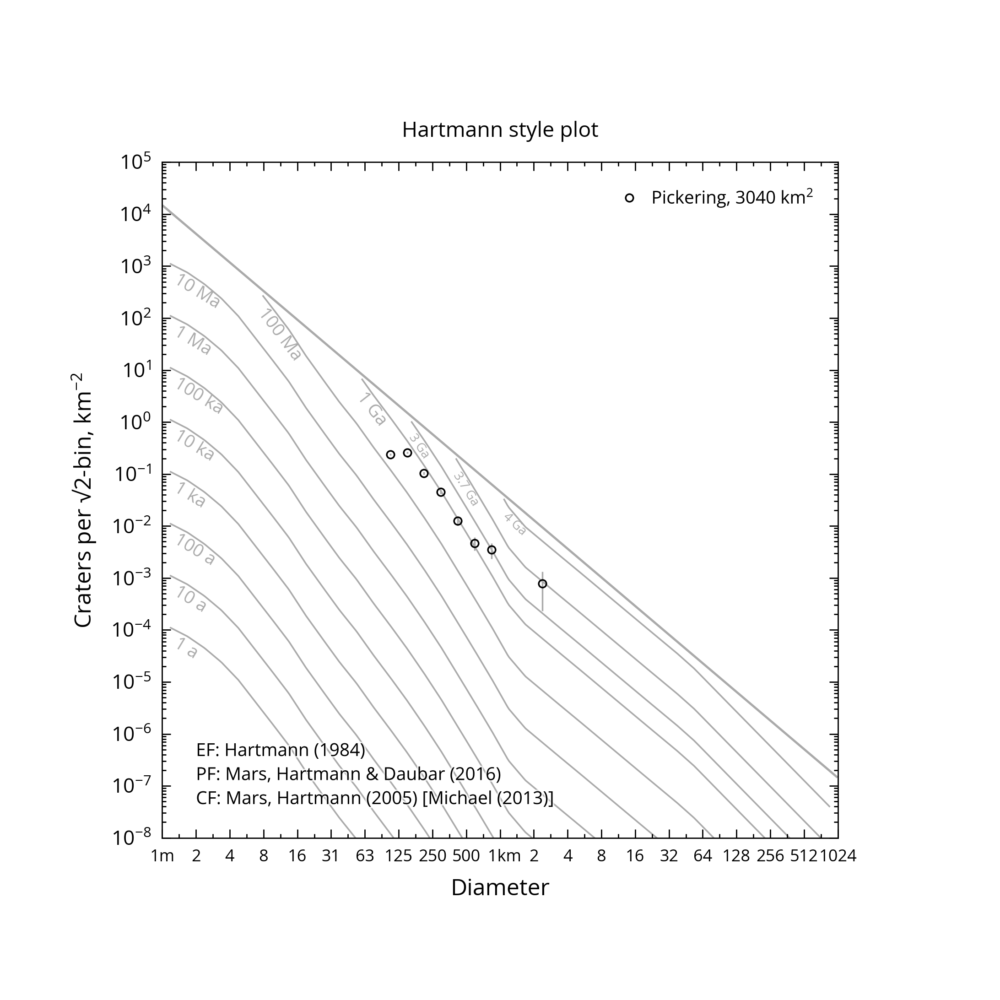
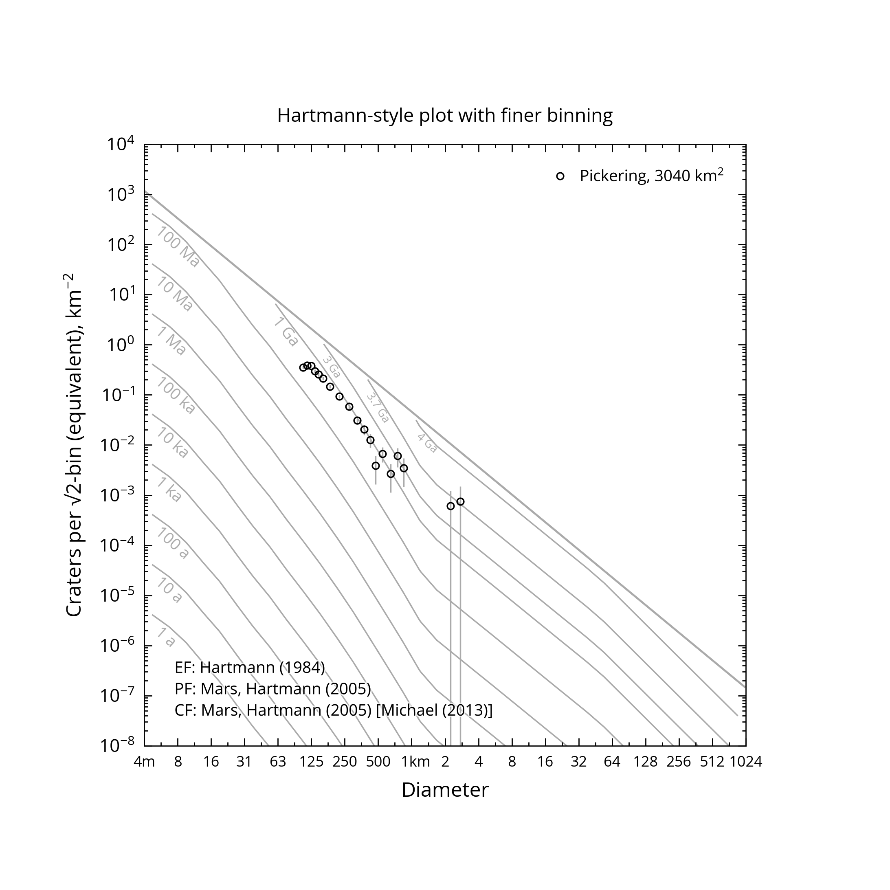
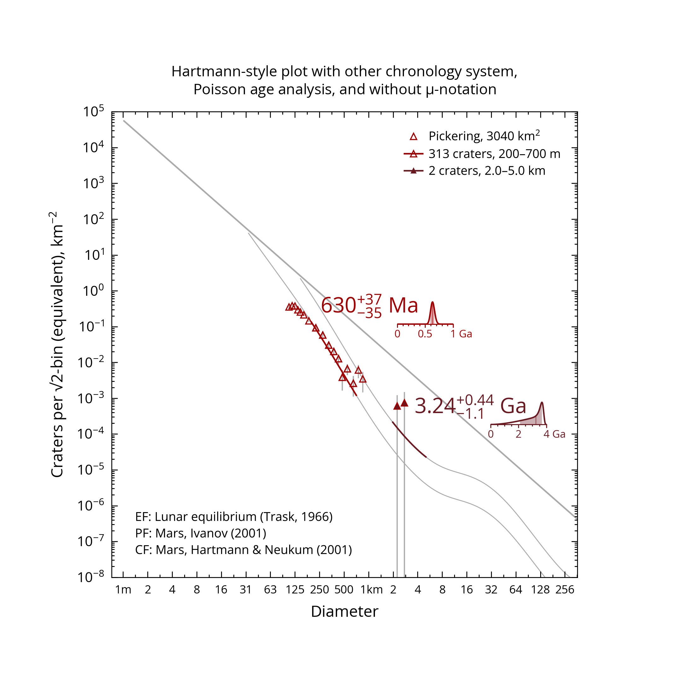

# Gallery



Demo 5

```
-pr cumul
-cs neukumivanov
-title Cumulative fits showing resurfacing correction|and fitted isochrons
-p source=%sample%/Pickering.scc,psym=sq
-p type=c-fit,range=[2,5],isochron=1
-p range=[.2,.7],resurf=1,psym=fsq
```



Demo 6

```
-pr cumul
-cs neukumivanov
-ep mars
-ef trask
-title Cumulative fits showing resurfacing correction,|equilibrium function and epoch system
-p source=%sample%/Pickering.scc,psym=sq
-p type=c-fit,range=[2,5]
-p range=[.2,.7],resurf=1,psym=fsq
```



Demo 7

```
-pr cumul
-cs neukumivanov
-legend fnaN
-title Modified legend 1:|renamed data series, N(1) value but no count or diameter range
-p source=%sample%/Pickering.scc,psym=sq,name=Area 1
-p type=c-fit,range=[.2,.7],resurf=1,psym=fsq
```
